<p align="center">
  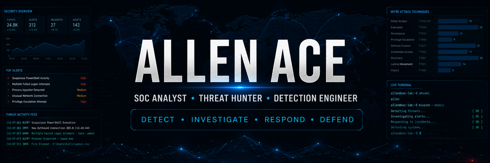
</p>

<br>

# 🛡️ Allen Ace

### SOC Analyst | Threat Hunter | Detection Engineer

> Detect • Investigate • Respond • Defend

## Welcome

This portfolio documents my hands-on cybersecurity journey through practical investigations, enterprise lab environments, detection engineering, digital forensics, malware analysis, threat hunting, and security analytics.

Each project demonstrates investigative methodology, security tooling, evidence correlation, detection development, and defensive thinking expected within a modern Security Operations Center (SOC).

<p align="center">


</p>

<p align="center">


</p>

## 📚 Table of Contents

- [About Me](#about-me)
- [Portfolio Highlights](#portfolio-highlights)
- [Current Focus](#current-focus)
- [Featured Projects](#featured-projects)
- [Technical Skills](#technical-skills)
- [Security Investigations](#security-investigations)
- [Malware Analysis](#malware-analysis)
- [Email Security](#email-security)
- [Security Engineering](#security-engineering)
- [Security Tool Development](#security-tool-development)
- [Detection Engineering](#detection-engineering-planned)
- [Certifications](#certifications)
- [Community](#community)
- [Cybersecurity Journey](#my-cybersecurity-journey)
- [Technical Articles](#technical-articles)
- [Video Walkthroughs](#video-walkthroughs)
- [Portfolio Statistics](#portfolio-statistics)
- [Contact](#contact)

## 👋 About Me

SOC Analyst with hands-on experience in Threat Hunting, Digital Forensics & Incident Response (DFIR), Detection Engineering, Malware Analysis, Security Analytics, and Python-based security tooling.

My work focuses on evidence-driven investigations, enterprise-style security monitoring, endpoint analysis, network analysis, malware investigations, memory forensics, and detection development aligned with the MITRE ATT&CK framework.

## Portfolio Highlights

- 10+ Enterprise-style Security Investigations
- Purple Team Attack Simulation & Defensive Investigation
- Static & Dynamic Malware Analysis
- Memory Forensics with Volatility 3 & MemProcFS
- Digital Forensics & Incident Response (DFIR)
- Threat Hunting with Splunk & Elastic
- Detection Engineering & SIEM Correlation
- Network Traffic & PCAP Analysis
- Security Analytics & Machine Learning
- Python Security Automation
- Technical Writing & Community Education

---

## 🎯 Current Focus

- Detection Engineering
- Threat Hunting
- Purple Team Operations
- Malware Analysis
- Digital Forensics & Incident Response
- Memory Forensics
- Python Security Automation

---

## ⭐ Featured Projects

| Project | Focus Area | Repository |
|---------|------------|------------|
| 🟣 Purple Team Simulation 01 | Attack Simulation / Detection Engineering | [View](https://github.com/0x0allenace/purple-team-simulation-01) |
| 🧠 Memory Forensics Investigation | Memory Forensics / DFIR | [View](https://github.com/0x0allenace/memory-forensics-investigation) |
| Threat Hunting – Reconnaissance | Splunk Threat Hunting | [View](https://github.com/0x0allenace/Threat-Hunting-Recon) |
| Enterprise DFIR Lab | Incident Response | [View](https://github.com/0x0allenace/ecorp-initial-dfir-lab) |
| Velociraptor Forensic Triage | Endpoint Forensics | [View](https://github.com/0x0allenace/velociraptor-forensic-triage-kape) |
| Suspicious Email Attachment Analysis | Email Security | [View](https://github.com/0x0allenace/suspicious-email-attachment-analysis) |
| Static Malware Analysis | Malware Analysis | [View](https://github.com/0x0allenace/static-malware-analysis-report) |
| Windows Malware Behavioral Analysis | Dynamic Malware Analysis | [View](https://github.com/0x0allenace/windows-malware-behavioral-analysis) |
| Behavioral Anomaly Detection | Machine Learning | [View](https://github.com/0x0allenace/security-anomaly-project) |
| File Signature Detector | Python Security Tool | [View](https://github.com/0x0allenace/file-signature-detector) |

---

## 🔗 Connect

- 🔗 [**LinkedIn**](https://www.linkedin.com/in/allen-ace-soc-analyst/)
- 💻 [**GitHub**](https://github.com/0x0allenace)

---

## 🛠️ Technical Skills

| Domain | Technologies |
|---------|--------------|
| SIEM | Splunk, Elastic Security |
| Threat Hunting | SPL, EQL, KQL/Search-based Investigation, MITRE ATT&CK |
| Detection Engineering | Sigma, SPL, EQL, Behavioral Detection, Sequence Detection |
| DFIR | Velociraptor, KAPE, Autopsy, FTK Imager |
| Memory Forensics | Volatility 3, MemProcFS |
| Malware Analysis | PEStudio, Detect It Easy, FLOSS, Procmon, Process Explorer |
| Network Analysis | Wireshark, PCAP Analysis, TCP/IP |
| Endpoint Security | Sysmon, Windows Event Logs, Elastic Defend |
| Purple Team | Attack Simulation, Defensive Validation, Detection Validation |
| Programming | Python, PowerShell |
| Infrastructure | Active Directory, pfSense, Windows |
| Evidence Analysis | IOC Extraction, Timeline Reconstruction, Process Analysis |

## 🛡️ Security Investigations

> Enterprise-style investigations demonstrating incident response, threat hunting, digital forensics, memory analysis, malware analysis, network forensics, and detection engineering.

### 🟣 Purple Team Simulation

> Controlled adversary simulation followed by Blue Team detection, investigation, network forensics, and detection engineering.

#### 🎯 Objective

Conduct a controlled PowerShell-based attack simulation within an isolated laboratory environment and evaluate whether endpoint and network telemetry could be used to detect, investigate, reconstruct, and respond to the attack.

#### 🛠️ Technologies

- Elastic Security
- Splunk
- Sysmon
- Wireshark
- PowerShell
- Kali Purple
- Netcat
- Python HTTP Server

#### 🔍 Investigation Focus

- PowerShell execution analysis
- Windows process-tree reconstruction
- Suspicious network activity
- Reverse-shell detection
- Network packet analysis
- SIEM investigation
- IOC identification
- Timeline reconstruction
- Detection engineering
- Cross-tool evidence correlation

#### 🎯 MITRE ATT&CK Mapping

| Technique | ATT&CK ID |
|-----------|-----------|
| PowerShell | T1059.001 |
| Command and Scripting Interpreter | T1059 |
| Ingress Tool Transfer | T1105 |
| System Owner/User Discovery | T1033 |
| System Information Discovery | T1082 |
| System Network Configuration Discovery | T1016 |
| Network Service Scanning | T1046 |

#### 🔍 Key Findings

- Reconstructed the simulated attack chain from endpoint and network telemetry.
- Identified suspicious PowerShell execution and process relationships.
- Detected remote payload retrieval activity.
- Identified and analyzed reverse-shell network communications.
- Correlated Sysmon events with packet-level evidence.
- Extracted host and network Indicators of Compromise.
- Developed detection logic using both Elastic and Splunk.
- Demonstrated the value of correlating endpoint, SIEM, and network evidence rather than relying on a single telemetry source.

#### 📸 Evidence

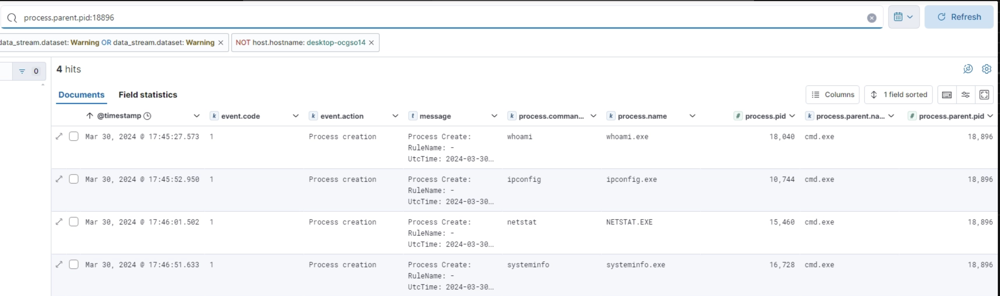

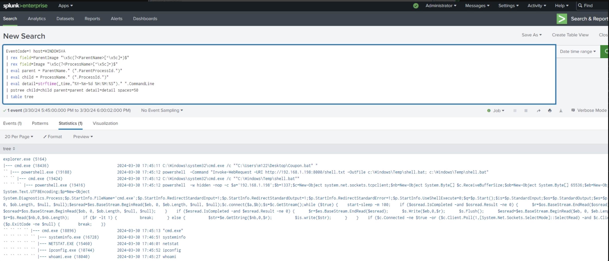

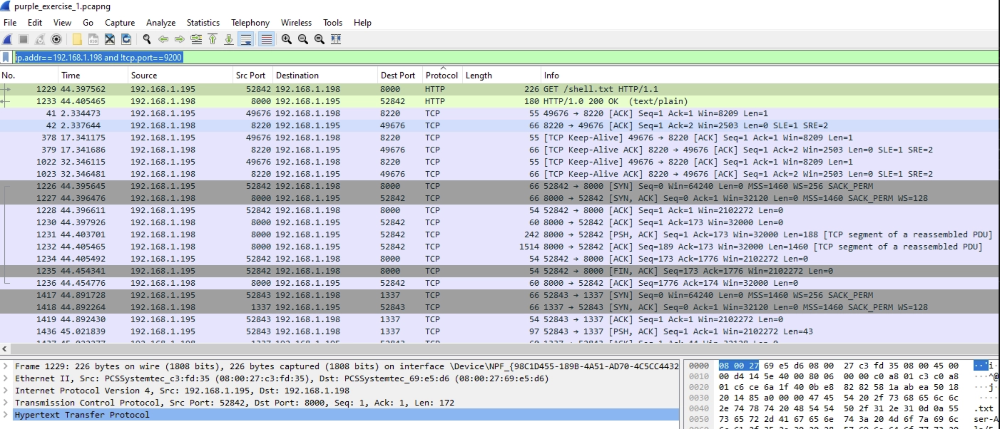

#### 🔗 Repository

[Purple Team Simulation — PowerShell Reverse Shell Detection & Investigation](https://github.com/0x0allenace/purple-team-simulation-01)

#### 💡 Lessons Learned

- Strengthened purple team methodology by connecting adversary simulation with defensive investigation.
- Improved PowerShell and Windows process analysis.
- Strengthened SIEM investigation and detection engineering skills across Splunk and Elastic.
- Improved network forensic analysis using Wireshark and PCAP evidence.
- Reinforced evidence correlation across endpoint, SIEM, and network telemetry.

---

### 🧠 Memory Forensics Investigation

> Evidence-driven Windows memory forensics investigation using Volatility 3 and MemProcFS to identify suspicious processes, injected code, anomalous memory regions, loaded modules, network artifacts, and Indicators of Compromise.

#### 🎯 Objective

Analyze a captured Windows memory image to identify suspicious process activity, memory anomalies, injected code, loaded modules, network artifacts, and other evidence associated with potential compromise.

#### 🛠️ Technologies

- Volatility 3
- MemProcFS
- FLARE-VM
- Procmon
- Windows
- Memory Forensics
- Digital Forensics

#### 🔍 Investigation Focus

- Process analysis
- Suspicious memory regions
- Code injection analysis
- PE and memory artifact analysis
- Loaded module investigation
- Network artifact analysis
- Cross-tool forensic correlation
- Timeline reconstruction
- IOC extraction
- Evidence integrity

#### 🔬 Methodology

The investigation followed an evidence-driven forensic workflow:

```text
Investigation Question
        ↓
Evidence Collection
        ↓
Artifact Identification
        ↓
Analysis
        ↓
Cross-Tool Correlation
        ↓
Finding
        ↓
IOC Extraction
        ↓
Detection / Response Opportunity
```

#### 🔍 Key Findings

- Investigated suspicious process activity within a captured Windows memory image.
- Analyzed anomalous memory regions and potential injected code.
- Examined loaded modules and PE-related memory artifacts.
- Investigated network artifacts associated with suspicious processes.
- Correlated Volatility 3 and MemProcFS findings.
- Extracted host and network Indicators of Compromise.
- Documented findings using an evidence-driven forensic methodology.
- Maintained supporting evidence, timelines, analyst notes, and forensic artifacts.

#### 📊 Forensic Artifacts

The investigation includes:

- Executive Summary
- Technical Investigation Report
- Analyst Notebook
- Execution Timeline
- Findings
- Host IOCs
- Network IOCs
- Volatility 3 artifacts
- MemProcFS artifacts
- Evidence integrity documentation
- Supporting screenshots

#### 📸 Evidence

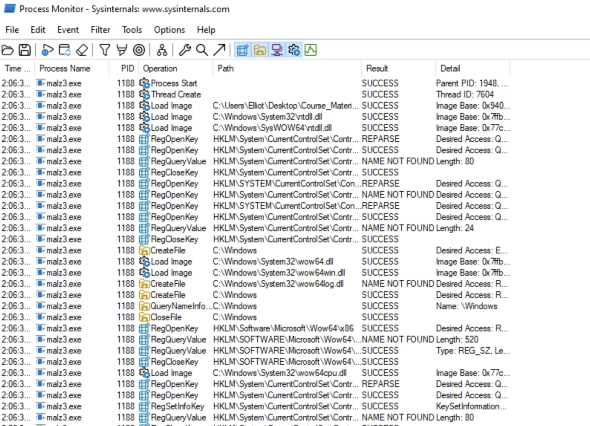

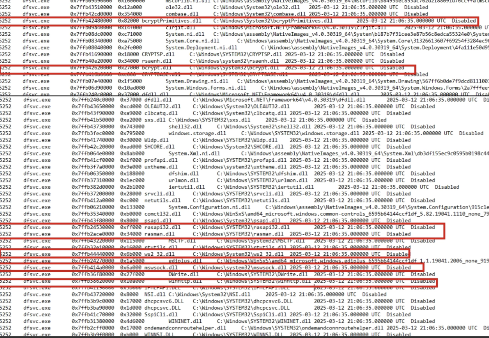

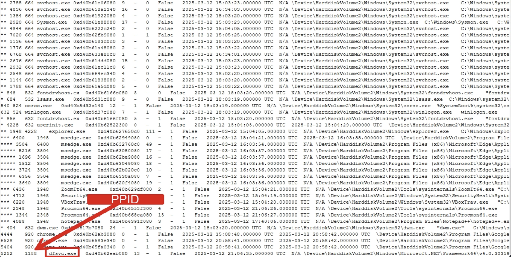

#### 🔗 Repository

[Memory Forensics Investigation](https://github.com/0x0allenace/memory-forensics-investigation)

#### 💡 Lessons Learned

- Strengthened Windows memory forensics methodology.
- Improved process and memory artifact analysis.
- Strengthened cross-tool forensic correlation using Volatility 3 and MemProcFS.
- Improved identification and documentation of forensic Indicators of Compromise.
- Reinforced evidence-driven investigation and incident-response workflows.

---

### 🔎 Threat Hunting

> Leveraging SIEM technologies to proactively identify, investigate, and respond to adversary behavior using real-world datasets and the MITRE ATT&CK framework.

#### Threat Hunting – Reconnaissance

##### Objective

Investigate reconnaissance activity within the BOTS v2 dataset using Splunk.

##### Technologies

- Splunk
- Windows Event Logs
- MITRE ATT&CK

##### MITRE ATT&CK

| Technique | ID |
|-----------|----|
| Active Scanning | T1595 |
| Gather Victim Network Information | T1590 |

##### Key Findings

- Suspicious User-Agent identified
- External IP pivot completed
- IOC extraction performed

##### Screenshots

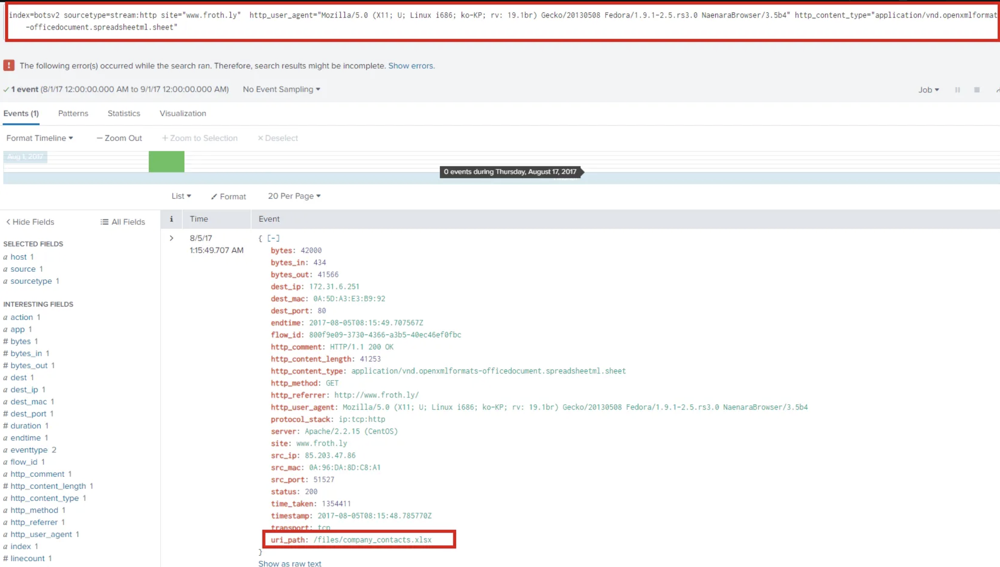

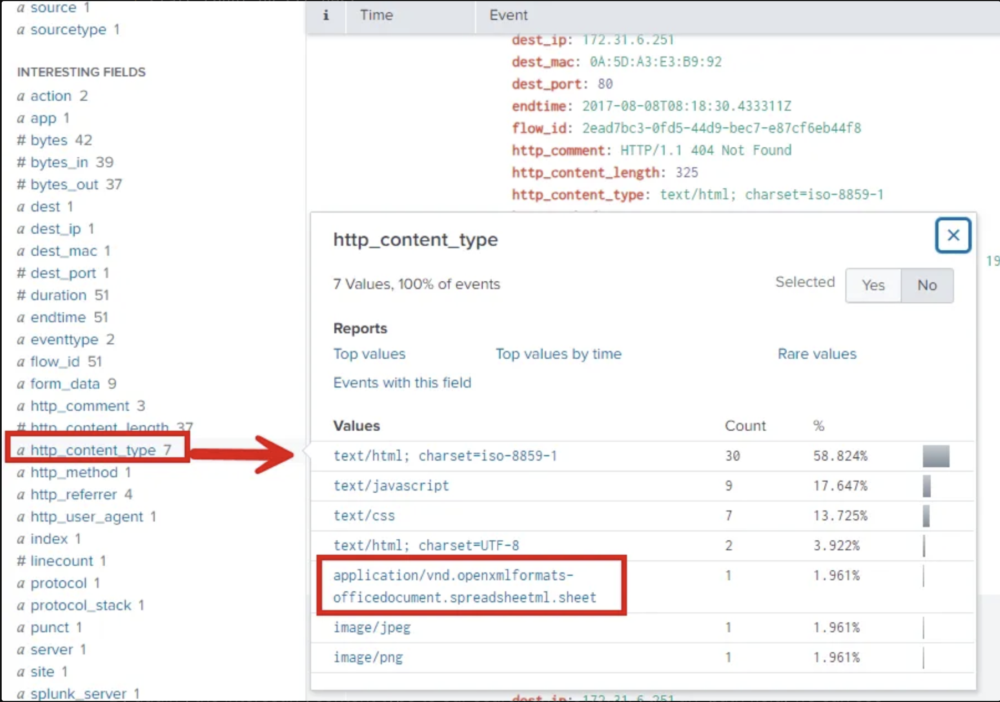

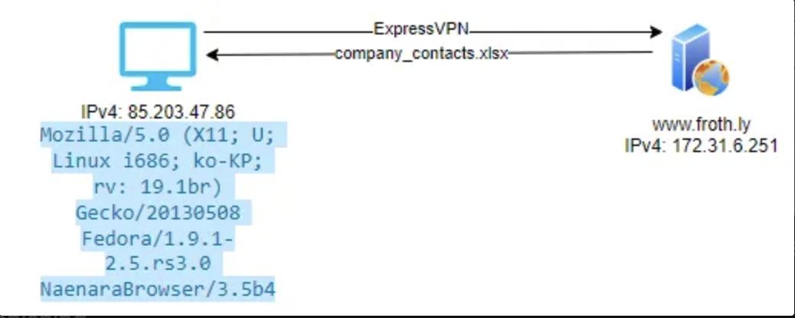

##### 🔗 Repository

[Threat Hunting – Reconnaissance](https://github.com/0x0allenace/Threat-Hunting-Recon)

##### 💡 Lessons Learned

- Improved Splunk investigation methodology.
- Reinforced ATT&CK mapping skills.
- Strengthened IOC correlation workflow.
- Enhanced understanding of enterprise SOC investigations.

#### 📌 Enterprise DFIR Lab

##### 🎯 Objective

Simulate an enterprise incident response environment using Active Directory, pfSense, Velociraptor, and attacker emulation.

##### 🛠️ Technologies

- Velociraptor
- Active Directory
- pfSense
- Windows Event Logs
- KAPE
- Sysmon

##### 🎯 MITRE ATT&CK Mapping

| Technique | ID |
|-----------|----|
| Credential Dumping | T1003 |
| Remote Services | T1021 |
| Lateral Tool Transfer | T1570 |

##### 🔍 Key Findings

- Conducted enterprise-wide investigation.
- Collected forensic artifacts.
- Contained compromised hosts.
- Documented incident response workflow.

##### 📸 Screenshots

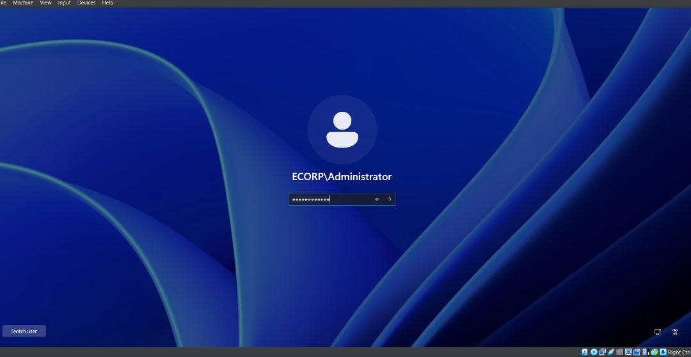

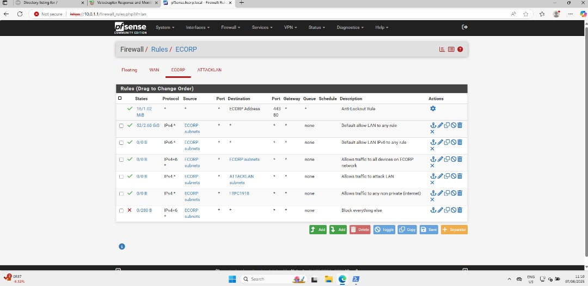

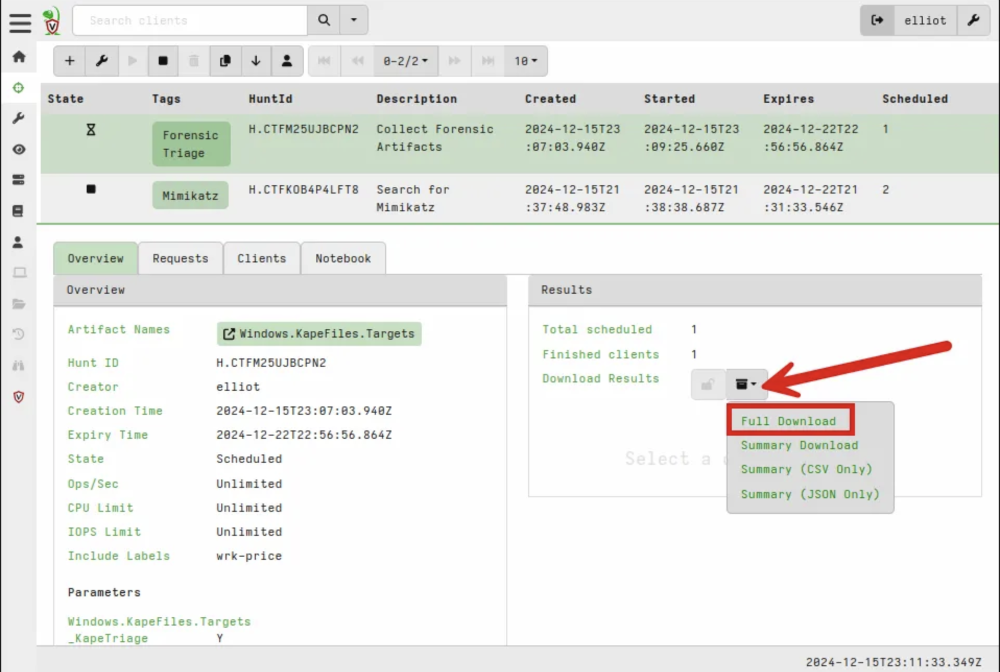

##### 🔗 Repository

- [Enterprise DFIR Lab](https://github.com/0x0allenace/ecorp-initial-dfir-lab)
- [Velociraptor KAPE Forensic Triage](https://github.com/0x0allenace/velociraptor-forensic-triage-kape)

##### 💡 Lessons Learned

- Improved Velociraptor artifact collection methodology.
- Reinforced victim isolation methodology.
- Strengthened IOC correlation workflow.
- Enhanced understanding of enterprise SOC investigations.

## 🦠 Malware Analysis

> Static and dynamic analysis of Windows malware samples to identify Indicators of Compromise, attacker techniques, malicious behaviors, and forensic artifacts using controlled malware analysis methodologies.

### 📌 Static Malware Analysis Report

#### 🎯 Objective

Perform static analysis on suspicious Windows PE files to identify malicious characteristics, extract Indicators of Compromise, and document findings using an enterprise-style malware analysis methodology.

#### 🛠️ Technologies

- PEStudio
- Detect It Easy (DIE)
- FLOSS
- Strings
- VirusTotal
- Hash Analysis
- Windows PE Format

#### 🎯 MITRE ATT&CK Mapping

| Technique | ID |
|-----------|----|
| Masquerading | T1036 |
| Obfuscated Files or Information | T1027 |

#### 🔍 Key Findings

- Identified suspicious PE characteristics.
- Extracted file hashes and Indicators of Compromise.
- Reviewed imported Windows API functions.
- Analyzed embedded strings and metadata.
- Documented suspicious behaviors without executing the samples.

#### 📸 Screenshots

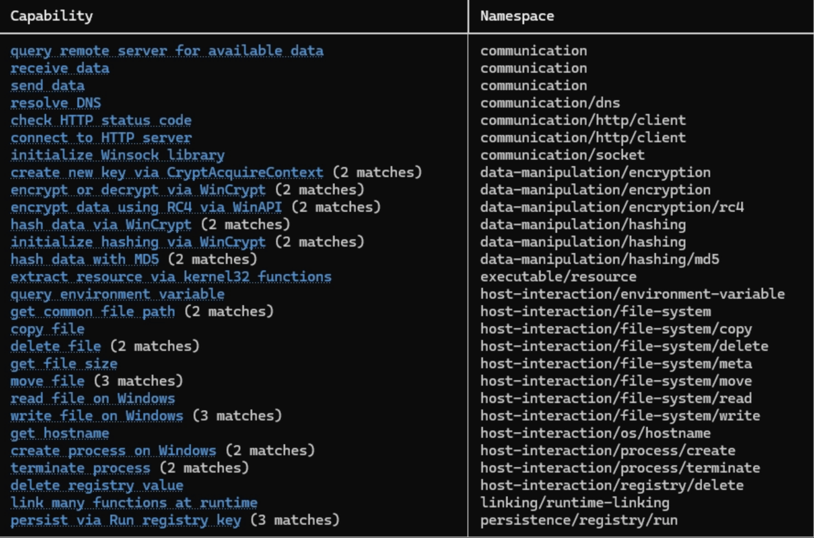

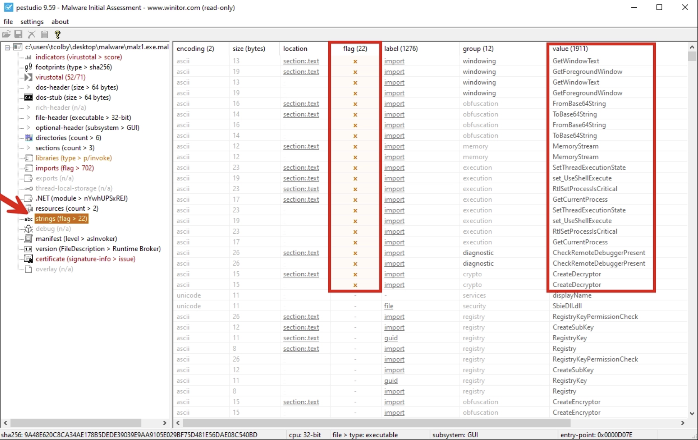

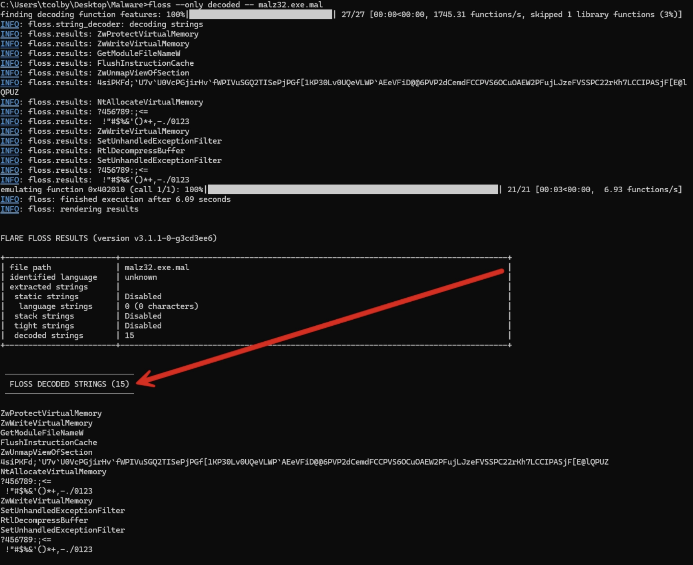

#### 🔗 Repository

[Static Malware Analysis Report](https://github.com/0x0allenace/static-malware-analysis-report)

#### 💡 Lessons Learned

- Strengthened Windows PE file analysis techniques.
- Improved malware triage methodology using static analysis.
- Reinforced IOC extraction and documentation workflows.
- Enhanced understanding of executable structures and suspicious artifacts.

### 📌 Windows Malware Behavioral Analysis

#### 🎯 Objective

Analyze the runtime behavior of a Windows malware sample within a controlled malware analysis laboratory to identify malicious activities, persistence mechanisms, process behavior, network communications, and Indicators of Compromise.

#### 🛠️ Technologies

- REMnux
- FLARE VM
- Procmon
- Process Explorer
- Wireshark
- FakeNet-NG
- Regshot
- Sysmon
- Windows Event Logs

#### 🔄 Analysis Workflow

- Initial malware triage
- Process analysis
- Registry monitoring
- Filesystem monitoring
- Network traffic analysis
- IOC extraction
- MITRE ATT&CK mapping

#### 🎯 MITRE ATT&CK Mapping

| Technique | ATT&CK ID |
|-----------|-----------|
| User Execution | T1204 |
| Command and Scripting Interpreter | T1059 |
| Process Injection | T1055 |
| Registry Run Keys / Startup Folder | T1547 |
| File and Directory Discovery | T1083 |
| Application Layer Protocol | T1071 |

#### 🔍 Key Findings

- Executed malware safely inside an isolated analysis environment.
- Observed process creation and parent-child relationships.
- Identified persistence mechanisms and registry modifications.
- Analyzed filesystem activity and dropped artifacts.
- Captured network communications and extracted Indicators of Compromise.
- Documented behavioral findings using a structured malware analysis workflow.

#### 📸 Screenshots

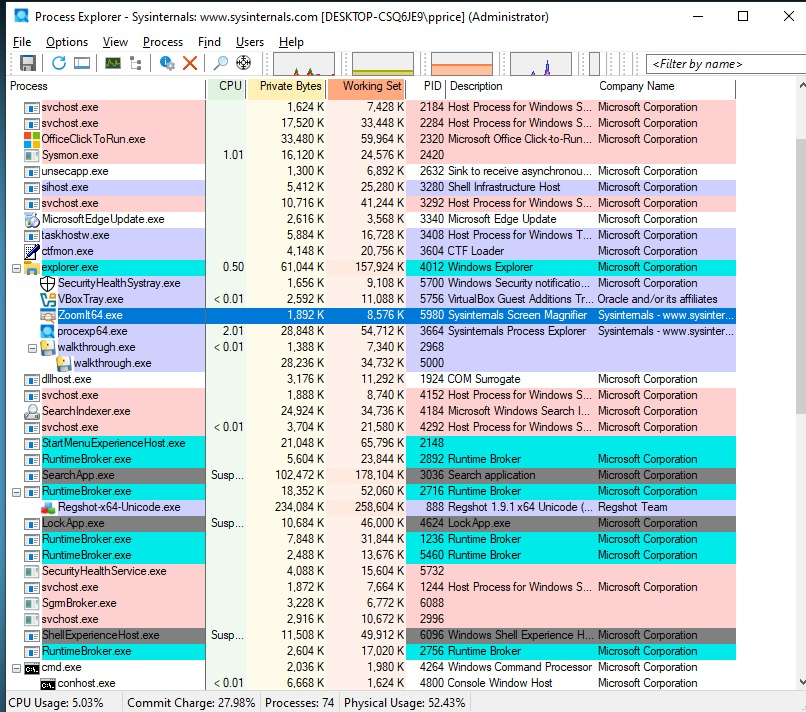

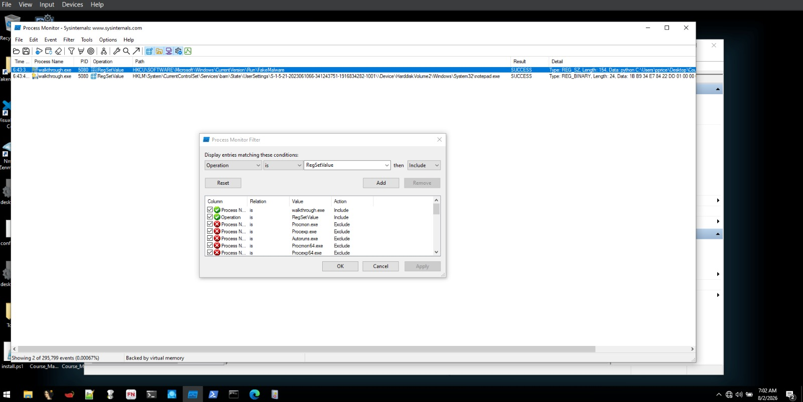

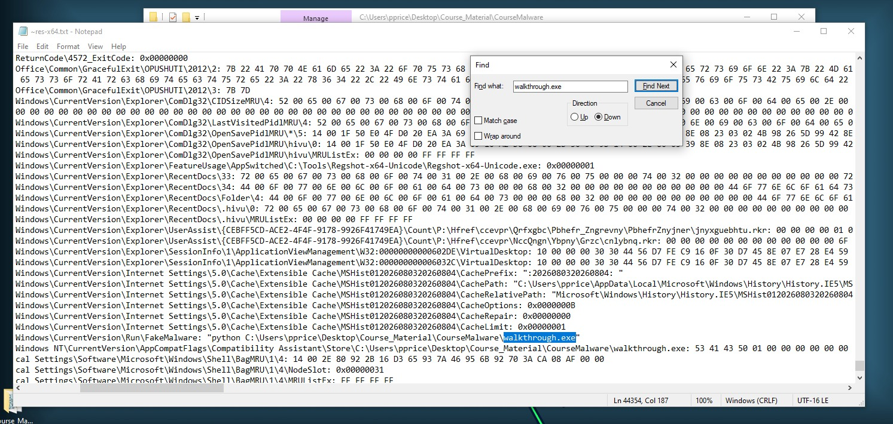

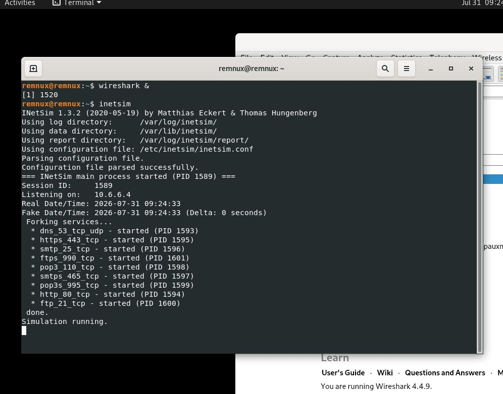

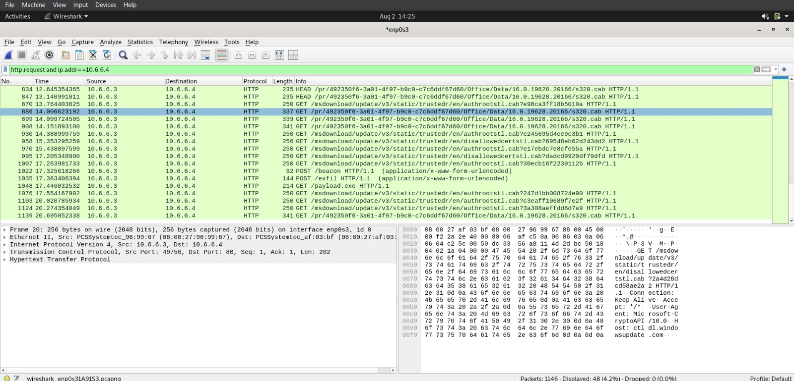

#### 🔗 Repository

[Windows Malware Behavioral Analysis](https://github.com/0x0allenace/windows-malware-behavioral-analysis)

#### 💡 Lessons Learned

- Strengthened dynamic malware analysis methodology.
- Improved behavioral IOC identification and correlation.
- Reinforced process, registry, and network activity analysis.
- Enhanced understanding of malware execution and persistence techniques.

## 📧 Email Security

> Investigation of phishing emails, malicious attachments, and email-based attack vectors.

### 📌 Suspicious Email Attachment Analysis

#### 🎯 Objective

Analyze suspicious email attachments within a controlled environment to determine malicious intent and identify Indicators of Compromise.

#### 🛠️ Technologies

- VirusTotal
- PE Studio
- File Signature Analysis
- Static Analysis

#### 🎯 MITRE ATT&CK Mapping

| Technique | ATT&CK ID |
|-----------|-----------|
| Phishing | T1566 |
| User Execution | T1204 |

#### 🔍 Key Findings

- Verified true file type.
- Examined embedded artifacts.
- Assessed malicious behavior.
- Documented findings.

#### 📸 Screenshots

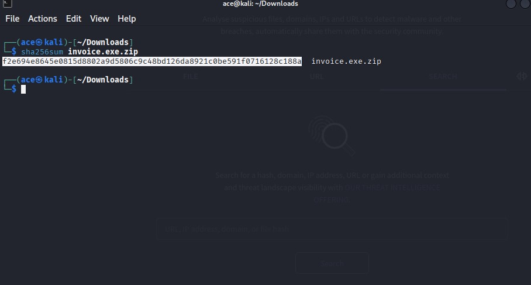

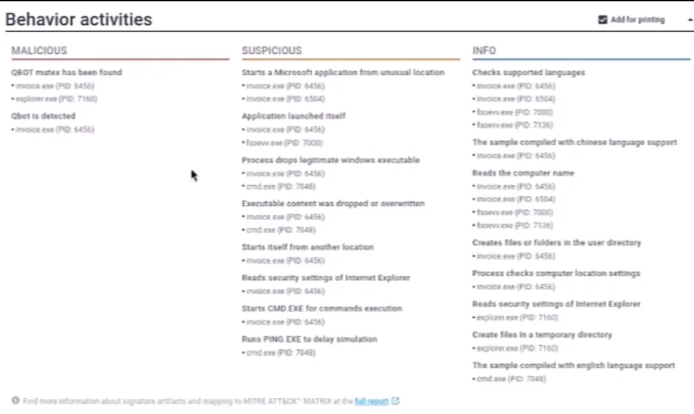

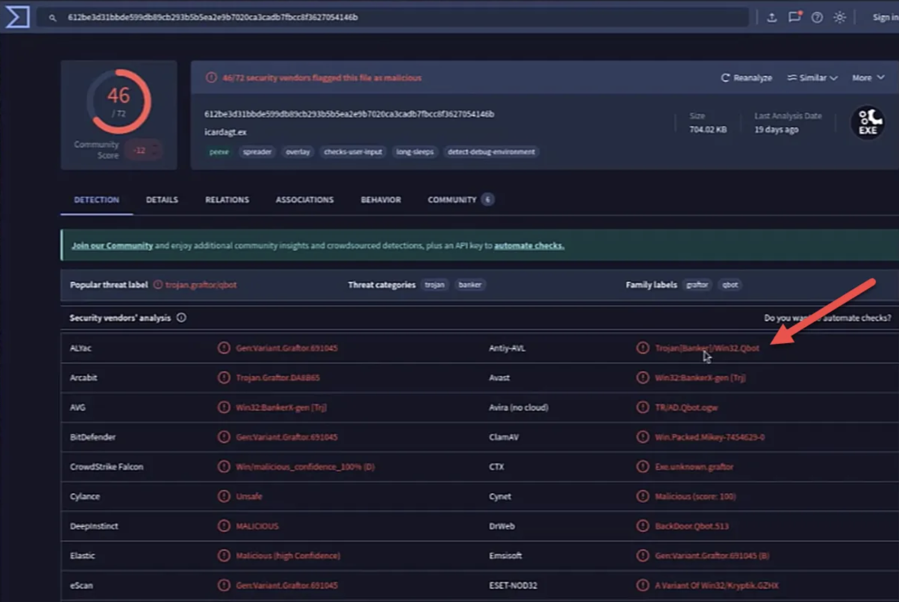

#### 🔗 Repository

[Suspicious Email Attachment Analysis](https://github.com/0x0allenace/suspicious-email-attachment-analysis)

#### 💡 Lessons Learned

- Strengthened malware triage and static analysis techniques.
- Improved identification and validation of Indicators of Compromise.
- Reinforced understanding of phishing attack delivery mechanisms and malicious attachments.
- Enhanced ability to correlate file artifacts with MITRE ATT&CK techniques during incident investigations.

## ⚙️ Security Engineering

> Building practical security tooling, detection content, and analytics that support enterprise security operations.

### 🤖 Security Analytics & Machine Learning

> Applying machine learning techniques to improve behavioral threat detection and anomaly identification in enterprise environments.

#### 📌 Behavioral Anomaly Detection

##### 🎯 Objective

Develop an unsupervised machine learning pipeline for identifying anomalous behavior within synthetic enterprise security logs.

##### 🛠️ Technologies

- Python
- Pandas
- Scikit-learn
- PyTorch
- Jupyter Notebook

##### 🤖 Models

- Isolation Forest
- Local Outlier Factor
- One-Class SVM
- Autoencoder

##### 🔍 Key Findings

- Generated synthetic enterprise log datasets.
- Engineered behavioral security features.
- Compared multiple anomaly detection algorithms.
- Evaluated model performance using multiple visualizations.

##### 📸 Screenshots

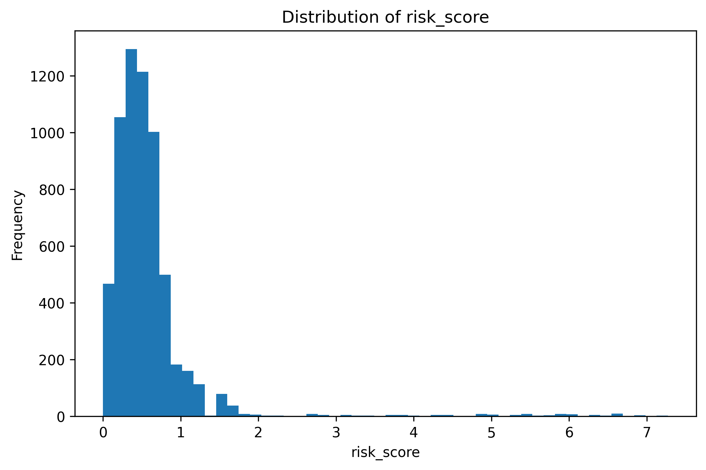

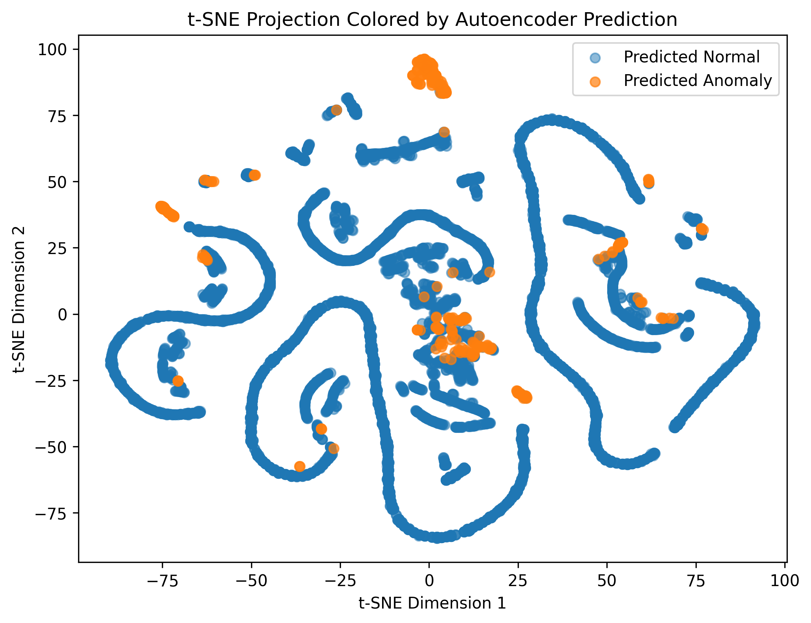

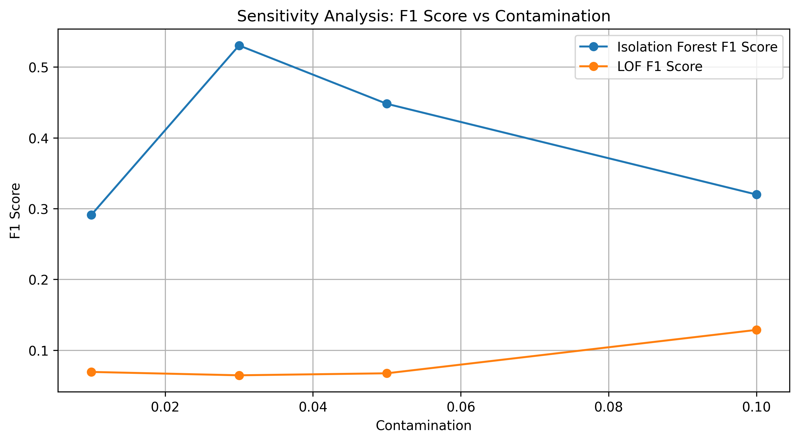

##### 🔗 Repository

[Behavioral Anomaly Detection](https://github.com/0x0allenace/security-anomaly-project)

##### 💡 Lessons Learned

- Improved feature engineering techniques for security event analysis.
- Strengthened understanding of unsupervised machine learning models for anomaly detection.
- Learned to evaluate and compare multiple detection algorithms using performance metrics and visualizations.
- Enhanced ability to translate behavioral analytics into practical threat detection use cases.

## 🛠️ Security Tool Development

> Lightweight security utilities developed to automate common Blue Team and DFIR workflows.

### 📌 File Signature Detector

#### 🎯 Objective

Develop a Python-based file signature analyzer capable of detecting true file types using magic bytes.

#### 🛠️ Technologies

- Python
- Magic Bytes
- Binary Analysis

#### ⚙️ Features

- True file type detection
- Malware triage support
- Reverse engineering assistance
- DFIR artifact validation

#### 🔗 Repository

[File Signature Detector](https://github.com/0x0allenace/file-signature-detector)

#### 💡 Lessons Learned

- Improved understanding of file signature analysis for file type validation.
- Reinforced Python programming skills through development of a practical security utility.
- Strengthened malware triage techniques by identifying files based on their binary signatures.
- Enhanced appreciation for file validation as a critical step in DFIR workflows.

## ⚙️ Detection Engineering *(Planned)*

> Designing and validating production-ready detections mapped to the MITRE ATT&CK® framework.

### 📚 Planned Projects

- Sigma Detection Library
- Splunk Detection Rules (SPL)
- Microsoft Sentinel Detection Rules (KQL)
- Elastic Detection Rules
- YARA Rules
- Detection-as-Code
- ATT&CK Coverage Matrix

## 📜 Certifications

Currently pursuing industry-recognized cybersecurity certifications.

### Planned

- CompTIA Security+
- Splunk Core Certified Power User
- Elastic Certified Analyst
- GIAC GCFA (Long-term)

## 🌐 Community

> Sharing knowledge through technical writing, walkthroughs, and continuous learning.

## 🗺️ My Cybersecurity Journey

### 2023

- Began professional cybersecurity transition.
- Worked on SOC operations and security monitoring.
- Built foundational SIEM investigation skills.
- Learned Splunk, Windows Event Logs, and detection workflows.

### 2024

- Expanded threat hunting capabilities.
- Investigated security incidents using enterprise-style datasets.
- Developed DFIR workflows.
- Started publishing technical research and walkthroughs.

### 2025

- Advanced threat intelligence and incident investigation skills.
- Built security automation tools using Python.
- Developed enterprise lab environments.

### 2026

- Expanded into purple team operations and detection validation.
- Completed memory forensics investigations using Volatility 3 and MemProcFS.
- Continued developing detection engineering capabilities.
- Expanded malware analysis and DFIR portfolio.
- Pursuing remote SOC, Threat Hunting, DFIR, and Detection Engineering opportunities.

## 📝 Technical Articles

### 📝 Featured Articles

- [Locking Down Against Bad USB: Detection and Defense Strategies](https://allenace.medium.com/locking-down-against-bad-usb-detection-and-defense-strategies-daf329415393?sharedUserId=allenace)
- [Wireshark: Getting to Know Wireshark](https://allenace.medium.com/wireshark-getting-to-know-wireshark-f8e19379cc50)
- [Discovering Security Weaknesses: A Practical Guide to Vulnerability Scanning](https://allenace.medium.com/discovering-security-weaknesses-a-practical-guide-to-vulnerability-scanning-30b2785b828f)
- [MemProcFS: The Game Changer in Memory Forensics](https://allenace.medium.com/memprocfs-the-game-changer-in-memory-forensics-463799a87aae)
- [Static Malware Analysis of Suspicious Windows PE Samples: A Blue Team Investigation](https://medium.com/@allenace/static-malware-analysis-of-suspicious-windows-pe-samples-a-blue-team-investigation-6c1e1b178513)
- [Behavioral Malware Analysis: Investigating a Multi-Stage Malware Sample Inside an Isolated Lab](https://allenace.medium.com/behavioral-malware-analysis-investigating-a-multi-stage-malware-sample-inside-an-isolated-lab-fba44d152d5b)
- [Memory Forensics Investigation Report](https://medium.com/@allenace/memory-forensics-investigation-report-a4487778c1d7)
- [Purple Team Simulation: Detecting and Investigating a Simulated PowerShell Reverse Shell](https://medium.com/@allenace/purple-team-simulation-detecting-and-investigating-a-simulated-powershell-reverse-shell-81029b69b946)

View all articles → [Medium](https://allenace.medium.com/)

## 🎥 Video Walkthroughs

### Latest Videos

- [Blue Team Detection Lab](https://www.youtube.com/watch?v=XnsfWq4TmLQ)
- Mythic C2 Lab *(planned)*
- Purple Team Simulation *(planned)*
- Memory Forensics Walkthrough *(planned)*
- Threat Hunting *(planned)*
- Active Directory Lab *(planned)*
- Elastic SIEM *(planned)*
- DFIR Walkthrough *(planned)*

## 📊 Portfolio Statistics

| Metric | Value |
|--------|------:|
| Security Investigations | 10+ |
| Threat Hunting Investigations | 2+ |
| DFIR Investigations | 3+ |
| Malware Analysis Reports | 2 |
| Purple Team Exercises | 1 |
| Memory Forensics Investigations | 1 |
| Machine Learning Projects | 1 |
| Security Tools Developed | 1 |
| Technical Articles Published | 80+ |
| Video Walkthroughs | 5 |
| MITRE ATT&CK Techniques Covered | 15+ |
| Languages | Python, PowerShell |

## 📫 Contact

- 🔗 [**LinkedIn**](https://www.linkedin.com/in/allen-ace-soc-analyst/)
- 📖 [**Medium**](https://allenace.medium.com)
- 💻 [**GitHub**](https://github.com/0x0allenace)
- 🎥 [**YouTube**](https://www.youtube.com/@PurpleOpsLab)
- 🐦 [**X**](https://x.com/allen_acee)
- 📧 **Email:** ejiakuallen@cyber-wizard.com

### 📈 GitHub Statistics


<p align="center">


</p>

<p align="center">


</p>

## 🤝 Let's Connect

I'm always interested in discussing:

- Security Operations (SOC)
- Threat Hunting
- Detection Engineering
- Purple Team Operations
- Malware Analysis
- Digital Forensics
- Memory Forensics
- Python Security Automation

Feel free to connect with me on LinkedIn or explore my repositories.

## ⭐ Thank You

Thank you for visiting my cybersecurity portfolio.

If you found these investigations useful, feel free to connect with me on LinkedIn, follow my work on Medium, or explore my repositories on GitHub.

I am always open to discussing cybersecurity, threat hunting, DFIR, detection engineering, and remote Security Operations opportunities.